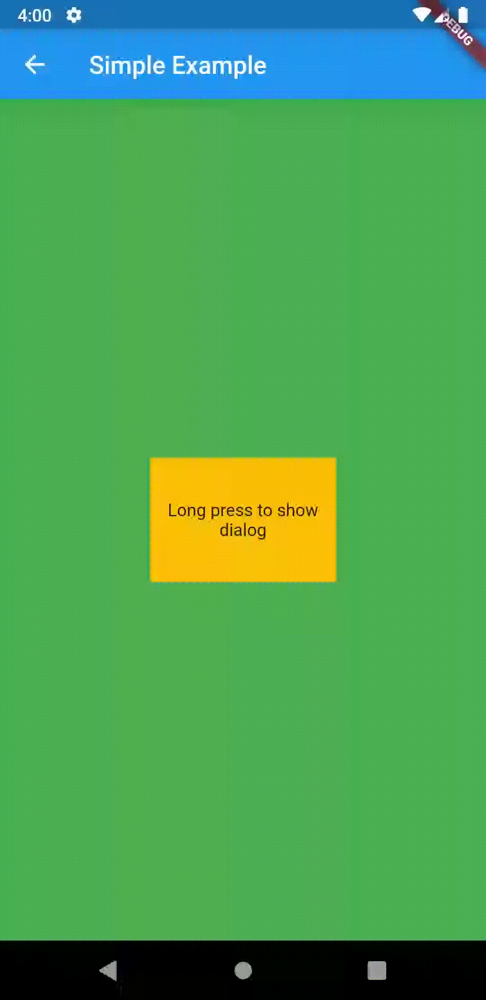

# peek_and_pop_dialog

A Flutter Widget that shows a dialog on LongPressStart and Hides on LongPressEnd.


## Usage

You just have to wrap the widget with **PeekAndPopDialog** Widget and don't forget the Dialog widget

```dart
return PeekAndPopDialog(
                  child: Container(
                    child: Text("Some Widget"),
                  ),
                  dialog: Container(
                    child: Text("The Dialog Widget"),
                    color: Colors.yellow,
                    height: 150.0,
                    width: 150.0,
                  ),
                );
```


**Demo**


  

